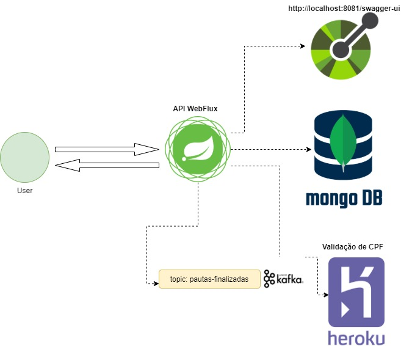

# Desafio SICREDI

## Diagrama da Aplicação

## Requisitos 
- Java 11
- Gradle
- docker e docker-compose

## Instruções Spring para rodar
Após clonar o projeto, e tendo docker instalado:

1. Roda o comando **docker-compose up -d** para levantar os containers do Mongodb e Kafka
2. Abrir o projeto sicredi-api na IDE de sua preferência e inicializar o projeto, que deve responder na porta 8081
3. Documentação da API responde no endereço: **[http://localhost:8081/swagger-ui](http://localhost:8081/swagger-ui)**

